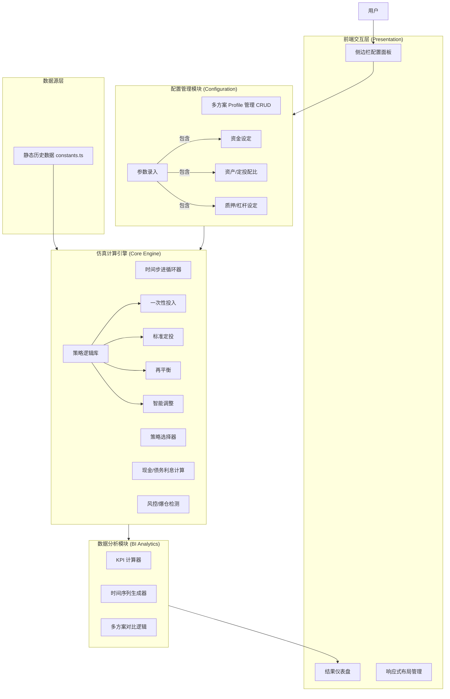

# QQQ/QLD 投资回测系统架构文档

## 1. 功能架构 (Architecture Fonctionnelle)

该应用采用了典型的 **客户端单页应用 (Client-Side SPA)** 架构，所有计算、数据处理和渲染均在浏览器端完成。系统设计遵循模块化原则，将配置、计算引擎与展示层解耦。

### 1.1 核心功能模块图

### 1.2 模块详细说明

#### A. 配置管理模块 (Configuration Management)
此模块负责处理业务规则的输入，是 BI 系统的“维度”定义阶段。
*   **多方案管理:** 支持创建、复制、删除、编辑多个投资组合（Profile），每个 Profile 视为一个独立的分析维度。
*   **资产配置 (Asset Allocation):** 定义初始资金和定投资金在 QQQ、QLD 和现金之间的分配比例。
*   **杠杆控制 (Leverage Control):** 这是一个高级功能，允许用户配置股票质押贷款（Stock Pledging），设定贷款利率、最大质押率 (LTV) 和提款逻辑。

#### B. 仿真计算引擎 (Simulation Engine)
这是系统的核心，相当于 BI 系统中的 ETL + 计算层。
*   **时间步进 (Time-stepping):** 按月遍历历史数据 (2000-2025)。
*   **策略分发 (Strategy Dispatch):** 根据用户选择 (`LUMP_SUM`, `DCA`, `REBALANCE`, `SMART`) 调用对应的 StrategyFunction。
*   **状态机 (State Machine):** 维护每个时间点的 `PortfolioState`，包含持仓数量、现金余额、债务余额、净值等。
*   **风控逻辑:** 实时计算 LTV (Loan-to-Value)，一旦超过阈值 (`maxLtv`)，立即触发“破产”状态并停止该策略的后续增长计算。

#### C. 数据分析与可视化模块 (Analytics & Visualization)
负责将仿真结果转化为商业洞察。
*   **KPI 计算:** 使用金融数学模型计算最终指标：
    *   **CAGR:** 年化复合增长率。
    *   **Max Drawdown:** 历史最大回撤。
    *   **Sharpe Ratio:** 夏普比率（风险调整后收益）。
    *   **IRR:** 内部收益率（考虑现金流的时间价值，使用牛顿迭代法求解）。
*   **图表渲染:**
    *   **趋势图:** 净值增长曲线。
    *   **回撤图:** 历史回撤百分比曲线。
    *   **堆叠面积图:** 现金 vs 股票仓位的动态占比分析。

---

## 2. 功能数据架构 (Functional Data Architecture)

数据架构展示了数据如何在系统中流动、转化和聚合。虽然是前端应用，但其内部数据模型具备严谨的数仓特征。

### 2.1 数据实体模型 (Domain Models)

| 实体 (Entity) | 类型 (Type) | 描述 (Description) | BI 对应概念 |
| :--- | :--- | :--- | :--- |
| **MarketData** | Raw Data | 包含 Date, QQQ价格, QLD价格 | 事实表 (Fact Table) - 基础行情 |
| **Profile** | Config | 用户定义的策略配置 (名称, 颜色, 策略类型, 配比参数) | 维度表 (Dimension Table) - 场景维度 |
| **PortfolioState** | State | 特定时间点的资产快照 (持仓, 现金, 债务, 总值, LTV) | 周期快照事实表 (Periodic Snapshot Fact) |
| **SimulationResult** | Aggregate | 包含完整历史序列 (History) 和计算后的指标 (Metrics) | 数据集市 (Data Mart) - 聚合结果 |

### 2.2 数据流管道 (Data Pipeline)

数据流遵循 **Input -> Process -> Aggregate -> Visualize** 的线性流程：

#### 第 1 阶段：数据摄取 (Ingestion)
*   **来源:** `constants.ts` 中的静态 JSON 数组。
*   **预处理:** 将原始的 QQQ 和 QLD 数组合并，按日期对齐，清洗掉缺失数据的日期，生成标准的 `MarketDataRow[]`。

#### 第 2 阶段：仿真循环 (Processing / ETL)
对于每一个 Profile（配置方案）：
1.  **初始化:** 建立 t=0 的初始状态（Initial Capital 分配）。
2.  **迭代计算:** 遍历市场数据行。
    *   **输入:** 上一状态 (`CurrentState`), 当前市场数据 (`MarketDataRow`).
    *   **变换:** 应用利息（现金/债务） -> 执行交易策略（买入/卖出/再平衡） -> 执行借贷逻辑（提款/爆仓检查）。
    *   **输出:** 新状态 (`NewState`).
3.  **异常处理:** 若 `Debt > Asset * MaxLTV`，标记 `isBankrupt = true`，后续价值归零。

#### 第 3 阶段：聚合与指标计算 (Aggregation)
仿真结束后，对生成的 `PortfolioState[]` 历史序列进行聚合计算：
*   **Final Balance:** 取序列最后一项的 `totalValue`。
*   **Risk Metrics:** 扫描全序列计算峰值和谷值，得出 `MaxDrawdown`；计算月度回报率的标准差得出 `SharpeRatio`。
*   **Return Metrics:** 基于初始投入和定期投入的现金流时间点，计算 `IRR`。

#### 第 4 阶段：展示数据转换 (Visualization Transformation)
为了适配 Recharts 图表库，需要进行行转列操作 (Pivoting)：
*   **宽表生成:** 将多个 SimulationResult 的历史数据合并。
    *   *Raw:* `[{date: '2000-01', strategyA: 100}, {date: '2000-01', strategyB: 120}, ...]`
    *   *UI Use:* 生成统一的 `chartData` 对象数组，键名为策略名称，值为净值。

### 2.3 关键数据逻辑 (Key Data Logic)

*   **现金拖累 (Cash Drag) 分析逻辑:**
    系统不仅计算总资产，还独立追踪 `cashBalance`。在数据架构中，这是一个关键的度量 (Measure)。通过计算 `Cash / TotalValue` 的比例，系统能够量化现金持有对投资组合表现的影响（即图表中的 "Cash Allocation Analysis"）。

*   **杠杆与负债 (Leverage & Debt):**
    引入了 `debtBalance` (负债余额) 这一新的度量。
    > **Net Equity (净值) = Assets (股票市值 + 现金) - Debt (负债)**
    
    数据流中必须严格保证净值的计算顺序，确保爆仓逻辑优于净值增长逻辑。

---

## 总结

这款应用展现了一个微型但完整的 **BI 决策支持系统** 架构：
*   **交互层** 解决了多场景配置的复杂性（尤其是移动端适配）。
*   **引擎层** 通过策略模式实现了算法的可扩展性。
*   **数据层** 通过严格的时间序列快照，确保了回测结果的精确性和可追溯性。
