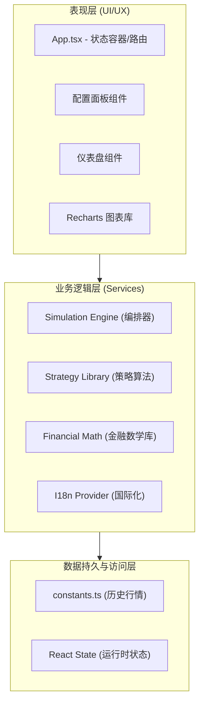

# QQQ/QLD 投资回测系统架构设计说明书

| 版本 | 日期 | 状态 |
| :--- | :--- | :--- |
| **1.0** | **2025-05** | **正式发布** |

---

## 1. 系统概述 (System Overview)

### 1.1 背景与目标
本系统是一款基于浏览器的高性能投资回测引擎，专为模拟纳斯达克100指数 (QQQ) 及其2倍杠杆ETF (QLD) 的混合投资策略而设计。系统旨在帮助投资者在无后端交互的情况下，通过调整资产配比、定投逻辑及杠杆参数，快速验证投资假设，并提供可视化的风险与收益分析。

### 1.2 核心能力
*   **多维度对比**：支持同时运行并对比多个投资组合（Profile）。
*   **复杂策略模拟**：支持一次性投入、定投 (DCA)、定期再平衡及智能调整策略。
*   **杠杆管理**：内置股票质押贷款逻辑，包含利息计算、提现及爆仓（LTV）风控。
*   **纯前端计算**：利用客户端算力，实现毫秒级回测（2000-2025年数据）。

---

## 2. 软件架构设计 (Software Architecture Design)

### 2.1 架构模式
系统采用 **客户端单页应用 (Client-Side SPA)** 架构，遵循 **Model-View-Controller (MVC)** 的变体模式：
*   **Model (数据层)**：由 TypeScript 接口定义 (`types.ts`) 和静态历史数据 (`constants.ts`) 组成。
*   **View (视图层)**：基于 React 组件树 (`components/`)，负责 UI 渲染和用户交互。
*   **Controller/Service (业务逻辑层)**：独立的纯函数模块 (`services/`)，负责核心算法调度。

### 2.2 技术栈 (Tech Stack)
*   **核心框架**: React 19 (UI 构建), TypeScript (静态类型安全)
*   **样式方案**: Tailwind CSS (原子化 CSS, 响应式布局)
*   **数据可视化**: Recharts (基于 SVG 的图表渲染)
*   **基础工具**: Lucide React (图标库), i18n Context (多语言支持)
*   **构建环境**: ES Modules (浏览器原生支持 import/export)

### 2.3 系统分层架构 (Layered Architecture)



### 2.4 模块详细设计

#### 2.4.1 核心计算引擎 (`services/simulationEngine.ts`)
这是系统的“心脏”，采用 **时间步进 (Time-Stepping)** 机制。
*   **输入**: 市场数据序列、策略函数、配置参数。
*   **职责**:
    1.  维护全局 `PortfolioState`。
    2.  按月循环：`计算利息` -> `执行策略` -> `处理杠杆/提款` -> `检查爆仓`。
    3.  聚合结果：生成 `SimulationResult`。

#### 2.4.2 策略工厂 (`services/strategies.ts`)
采用 **策略模式 (Strategy Pattern)** 实现算法解耦。
*   **接口定义**: `StrategyFunction` 接收当前状态和市场数据，返回新状态。
*   **实现**:
    *   `strategyLumpSum`: 初始买入 + 年度追加。
    *   `strategyDCA`: 标准定投。
    *   `strategyYearlyRebalance`: 每年1月强制回归目标配比。
    *   `strategySmartAdjust`: 基于 `StrategyMemory` 记忆上一周期状态，实现低吸高抛逻辑。

#### 2.4.3 金融数学库 (`services/financeMath.ts`)
提供纯数学计算功能的工具类。核心算法包括：
*   **CAGR (复合年化增长率)**: `(End/Start)^(1/n) - 1`
*   **MaxDrawdown (最大回撤)**: 峰值检测算法。
*   **Sharpe Ratio (夏普比率)**: 回报率标准差计算。
*   **IRR (内部收益率)**: 实现 **牛顿-拉夫逊迭代法 (Newton-Raphson)** 求解非线性方程，处理不规则现金流。

---

## 3. 详细数据架构设计 (Detailed Data Architecture Design)

### 3.1 概念数据模型 (Conceptual Data Model)
系统数据流转主要分为四个阶段：**配置 (Input) -> 行情 (Source) -> 状态 (State) -> 结果 (Output)**。

#### 3.1.1 输入实体：配置 (Configuration)
用户定义的每个 Profile 包含核心配置 `AssetConfig`。

| 字段 | 类型 | 业务含义 |
| :--- | :--- | :--- |
| **initialCapital** | Number | 初始本金 (T=0) |
| **qqqWeight / qldWeight** | Number | 初始及目标持仓比例 (0-100) |
| **contributionAmount** | Number | 定投金额 |
| **contributionInterval** | Number | 定投频率 (月/季/年) |
| **leverage** | Object | 杠杆配置对象 (包含利率、最大LTV、提现策略) |

#### 3.1.2 源数据实体：市场行情 (Market Data)
位于 `constants.ts`，为只读静态数据。系统启动时进行 ETL（提取、转换、加载）处理。
*   **原始结构**: 分离的 QQQ 数组和 QLD 数组。
*   **运行时结构 (`MarketDataRow`)**:
```typescript
interface MarketDataRow {
  date: string; // "YYYY-MM-DD"
  qqq: number;  // 调整后收盘价
  qld: number;  // 调整后收盘价
}
```

#### 3.1.3 核心状态实体：投资组合快照 (Portfolio State)
这是数据架构中最关键的实体，即 **周期快照事实表 (Periodic Snapshot Fact)**。
```typescript
interface PortfolioState {
  date: string;
  shares: {        // 持仓量 (维度)
    QQQ: number;
    QLD: number;
  };
  cashBalance: number; // 度量: 现金余额 (受利息、定投、提现影响)
  debtBalance: number; // 度量: 负债余额 (受质押提现、利息影响)
  totalValue: number;  // 度量: 净资产 (Assets - Debt)
  ltv: number;         // 度量: 当前质押率 (Risk Metric)
  strategyMemory: Record<string, any>; // 状态: 策略记忆体 (用于复杂策略跨周期决策)
}
```

### 3.2 数据流逻辑 (Data Flow Logic)

#### 3.2.1 净资产计算管道 (Net Equity Pipeline)
为了确保金融数据的准确性，`simulationEngine` 中的计算顺序严格遵循以下管道：
1.  **利息累积 (Accrual)**:
    *   `NewCash = OldCash * (1 + YieldRate)`
    *   `NewDebt = OldDebt * (1 + LoanRate)`
2.  **交易执行 (Execution)**:
    *   调用策略函数，修改 `shares` 和 `cashBalance`。
3.  **杠杆操作 (Leverage Action)**:
    *   若满足提现条件（如每年1月），增加 `debtBalance`。
4.  **风控检查 (Risk Check)**:
    *   计算 `LTV = Debt / (QQQ_Value)`。
    *   **Gatekeeper**: 若 `LTV > maxLtv`，触发熔断，`totalValue` 强制归零，标记 `isBankrupt`。
5.  **净值结算 (Settlement)**:
    *   `Assets = (Shares * Price) + Cash`
    *   `NetEquity = Max(0, Assets - Debt)`

#### 3.2.2 结果聚合 (Aggregation)
在前端展示层，数据被聚合为两种形式：
1.  **宽表 (Pivot Table) for Charts**: 将 `PortfolioState[]` 转换为 `[{date: '...', StrategyA: 1000, StrategyB: 1200}]`，便于 Recharts 绘制多线图。
2.  **指标摘要 (Metrics Summary)**: 对整个历史序列进行一次性扫描，计算 `MaxDD` 和 `Sharpe`，作为单行数据展示在仪表盘顶部。

---

## 4. 关键设计决策 (Key Design Decisions)

### 4.1 精度与性能的权衡
*   **决策**: 使用 JavaScript `number` (双精度浮点) 而非专门的 Decimal 库。
*   **理由**: 回测属于模拟性质，而非银行核心账务系统。前端浮点误差（如 0.0000001）对长周期 CAGR 回测结论影响可忽略，但能显著提升数万次迭代的计算性能。

### 4.2 状态管理去中心化
*   **决策**: 不使用 Redux 或 Zustand，仅使用 React `useState` + Props Drilling。
*   **理由**: 状态深度较浅（App -> Dashboard），且数据流向单一（自顶向下），引入状态管理库会增加不必要的复杂性。

### 4.3 静态数据源
*   **决策**: 将25年的历史数据硬编码在 `constants.ts`。
*   **理由**: 避免 API 请求延迟和第三方数据源的不稳定性，确保应用离线可用且瞬间加载，符合“计算器”工具的定位。

### 4.4 国际化架构
*   **决策**: 自研轻量级 Context 方案 (`services/i18n.tsx`)。
*   **理由**: 项目只需支持少量语言，且无需按需加载语言包。自研方案比 `react-i18next` 更轻量，无外部依赖。

---

## 5. 非功能性需求实现 (Non-Functional Requirements)

*   **响应式 (Responsiveness)**:
    *   通过 Tailwind 断点 (`lg:hidden`, `lg:flex`) 实现侧边栏在移动端的抽屉式交互和桌面端的固定式布局。
*   **可用性 (Usability)**:
    *   **颜色编码**: 系统为每个 Profile 自动分配高对比度颜色，并在所有图表、指标卡和表格中保持一致，降低用户认知负荷。
*   **容错性 (Fault Tolerance)**:
    *   即使策略爆仓，图表仍能渲染至爆仓前一刻，并显示明确的警告 UI。
*   **可维护性 (Maintainability)**:
    *   严格的 TypeScript 类型定义确保了重构时的安全性。
    *   策略逻辑与执行引擎分离，新增策略只需添加一个新的函数，无需修改引擎核心。
